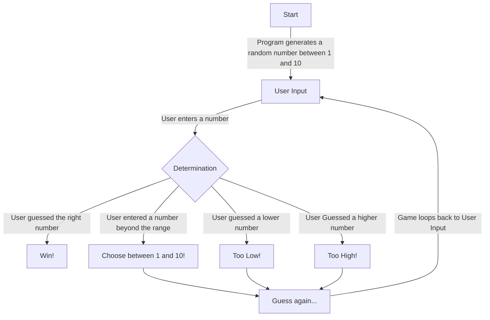

## Guessing Game

### Explanation
The game works by generating a random number (1-10) and comparing user input to the number.  
>* In cases where the user guesses correctly, the game simply outputs "Win!" and ends.  
>* In cases where the user guesses incorrectly, there are three possibilities.
>    * The user's number was beyond the range of the game
>    * The user's number was lower than the correct number
>    * The user's number was higher than the correct number
 
Regardless of the circumstances, in the case of an incorrect guess, the game loops back to the user guessing until victory.